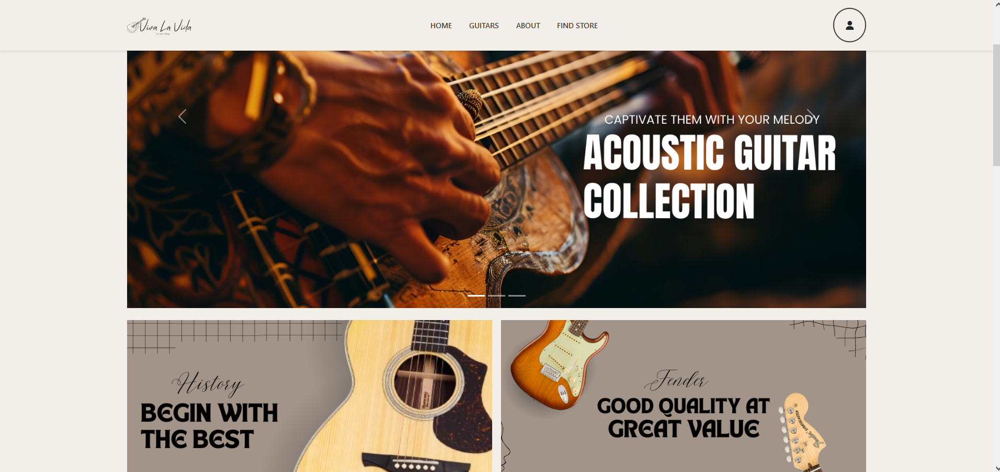
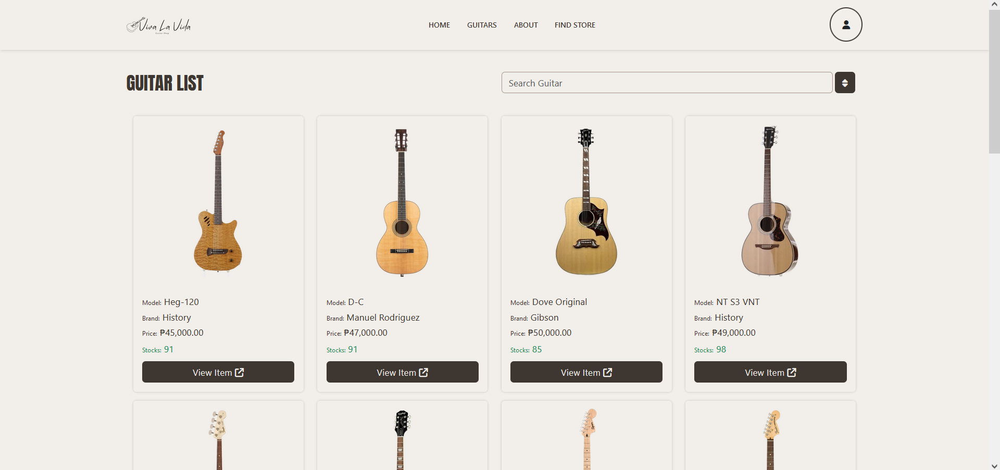
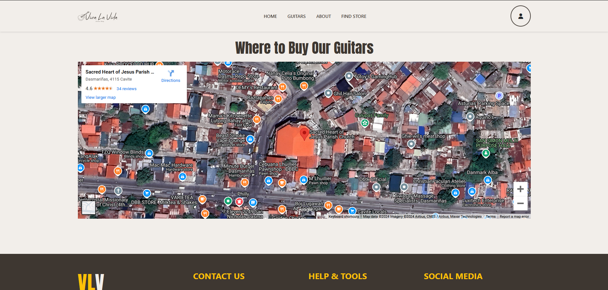
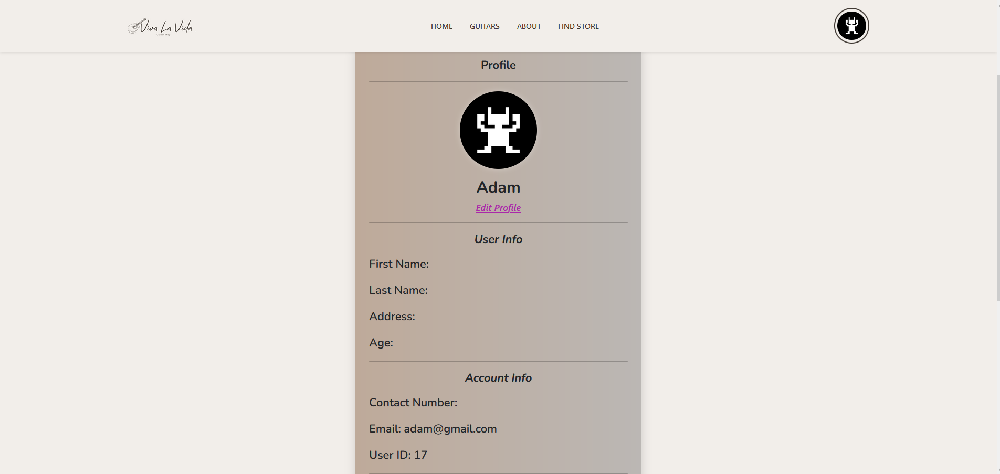
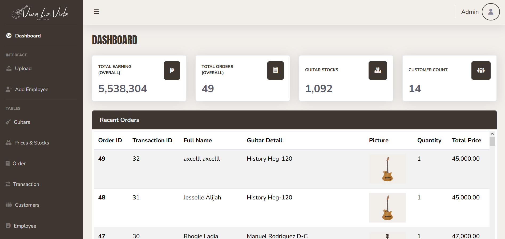
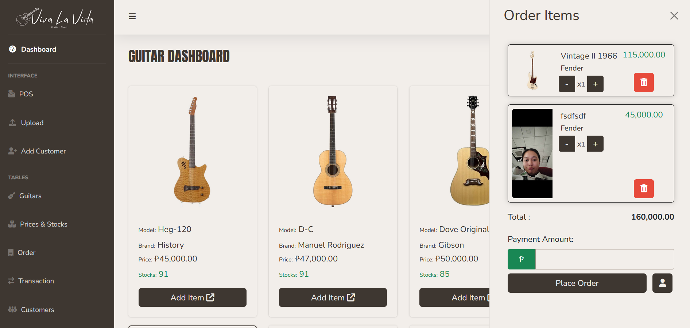
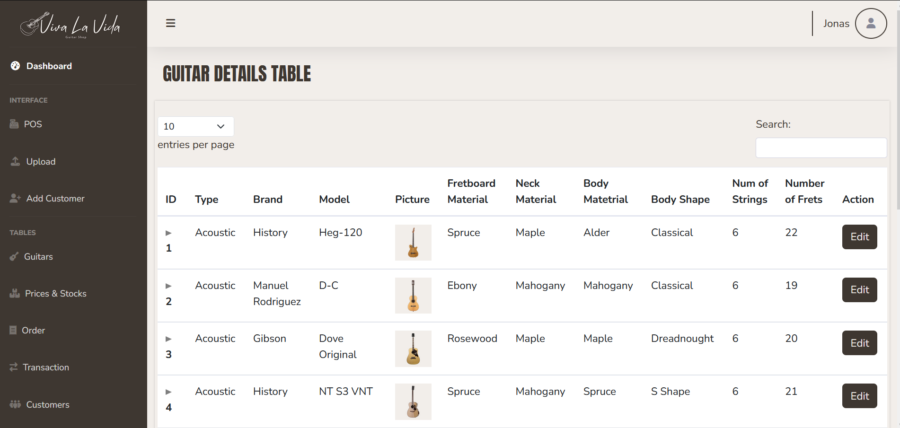

# Viva La Vida (VLV)
POS Web-based system that prodivdes a wiki for end users accessing our website, and enable transaction for the employees who will process the orders.
- <strong>Date started</strong> October 4, 2024
- <strong>Defense Date</strong> November 25, 2024

# Features
- <strong>Item search and filtering</strong> that can be seen on <a href="./php/individualItemPage.php">Item Page</a> and also at <a href="admin/orderingGuitar.php">Ordering guitar</a>. More comprehensive process can be seen at <a href="js/itemListSearch.js">itemListSearch.js</a>.
- <strong>AJAX requests</strong> are fully utilized at <a href="js/rightContent.js">rightContent.js</a> and also responsible for instant page processes without the need of refreshing it.
- Archiving an <strong>employee</strong> account that prrocess that is reference to a, or multiple transactions will result in 'NULL' value of that foreign key to the child table in the database, and at employee dashboard side will output 'N/A':
- And the same thing is applied in arhciving a <strong>user</strong>.
- <strong>Transaction table is the most important</strong>, so if it is deleted all the order table record that is referenced to that transaction_id will also be archived.
- Form validatorm, event listener upon submission of it, and prevention of form submision can all be seen at <a href="js/employeeFormValidator.js">employeeFormValidator.js</a>.

# Overview
### User side:
<a href="index.php" style="font-size: 16px;">Homepage</a>

<a href="php/itemList.php">Item List Page</a>

<a href="aboutUs.php">About Us Page</a>

<a href="findStore.php">Find Store Page</a>

<a href="php/profile.php">Profile Page</a>

### Admin & Employee side:
<a href="admin/adminIndex.php">Admin Dasboard</a>

<a href="admin/orderingGuitar.php">POS</a>

<a href="admin/guitarTablePage.php">Guitar Page</a>

# Improvements
- Hybrid with E-commerce should be incorporated;
- If this is push, different payment methods should be added, this can be backed with <strong>proof of payment feature</strong>.
- Sending the receipt through E-mail should also be possible.