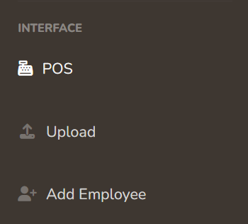
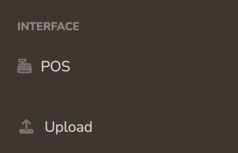
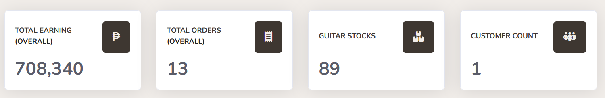
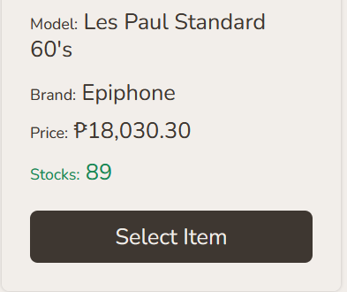
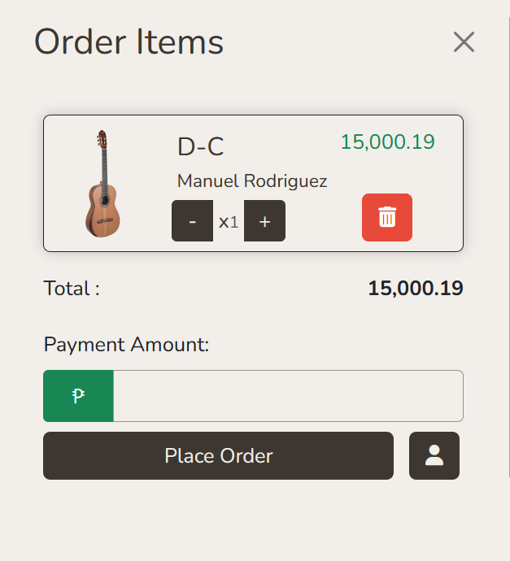
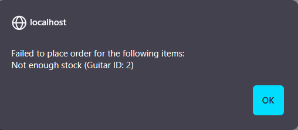
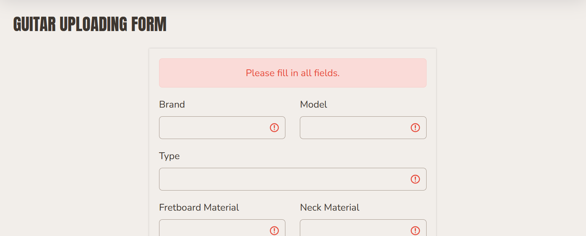
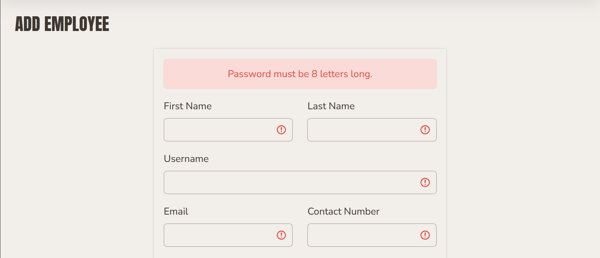
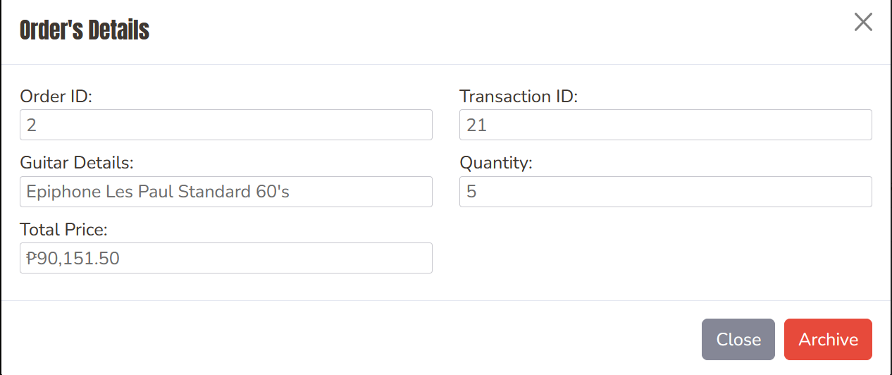

### Documentation: November 16, 2024 
<strong>Dev note:</strong> Run on MS Edge for better experience. Specially for password viewing.

# Files Overview
### Admin Side
- (<code>adminCLI.php</code>) used for creating admin account.
- (<code>orderingGuitar.php</code>) is for the actual POS.
- (<code>guitarUploadingForrm.php</code>) is for adding new guitar.
- (<code>employeeAdding.php</code>) (only for admin) is for adding new employee
- (<code>guitarTablePage.php</code>) is for (Read, Edit, Delete) of guitars.
- (<code>guitarTablePagePrice&Sto</code>)cks.php is extension of the former, but for stocks and price.
- (<code>orderViewTable.php</code>) is for visual representation of urder table.
- (<code>transactionViewTable.php</code>) is the same as the former, but for transaction table.
- (<code>customerViewTable.php</code>) same but for customer.

# Features

Most important

- Ensure that there are no duplicate Email or Username on both User and Employee table. Meaning if the account jonas@gmail.com is already at employee it shouldn't exist at user and vice versa.
- Inputs that are supposed to accept only letters and numbers should strictly validate to ensure no other characters are accepted.

Admin Side:

- There are different dashboard views for 'Admin' and 'Employee' type accounts. Some of the parts are only viewable or can be operated by 'Admin' accounts (There are more besides these two).
 
- The cards within the main dashboard should contain accurate data, and should be clickable leading to their respective tables 
- Each placed order should subtract the quantity to the stocks 
- Upon adding the guitar, the following should be present: (1) Clickable quantity buttons, (2) Payment Amount should only accept number and cannot proceed if insufficient amount is entered, (3) a customer should be selected first, no customer no placing order:
 
- By clicking 'Place Order' if the guitar stocks is less than the ordered item quantity it should output something like so 
- Validator for guitar uploading

- Validator for employee adding

- Tables, I disable some input because I think they aren't supposed to be change.

- Each button clicked on the tables should show an alert

# Issues & Bugs
### ERD / Database related
- Database connection (cardinality) ERD should be consulted to Sir Borj on Monday.
- Body_Material and Description column should be added.
- Customer Table should be added at the ERD
- Profile Picture and address columns should be removed for the user
- Role column should be added to the ERD; Btw, I changed the datatype to VARCHAR and added a DEFAULT value instead of using ENUM.
- Customer_ID should be foreign to the transaction table after the Transaction_ID column.

### Backend related
#### Admin
- <s>There's no Employee Table available as of the moment.</s>
- <s>User table should also be available</s>
- <s>All updating <code>.php</code> should have a checker if what they are updating  already exist.
(<code>employeeUpdating.php</code>), (<code>userUpdating.php</code>), (<code>guitarUpdating.php</code>), also in registrationHandler.</s>
- <s>Employee insertion shouldn't have a matching email, or username on Employee Table and User table</s>
- <s>Some monetary values on the receipt doesn't contain coma ( , ) yet.</s>
- <s>Undecided if Transaction Table & Urder Table should have Updating and Deletion operations (should this be for admin account only???).</s>
- <s>Input type files accepts all file types.</s>
- Datatable searching; Since (20)24 ngayon pag sinearch mo tuloy yung Transaction_ID na 20 di siya nalabas agad, kasi nga dahil sa year.
- <s>Emptying the whole guitar based on guitarId is still not possible</s>
- <s>Editing a guitar on Prices & Stocks has an issue on alert. "Selected a guitar" appear when update btn and clickced followed by "guaitar update"</s>
- <s>What was the password encryption that sir mentioned BRCYPT 12</s>
<code>$hashPassword = password_hash($password, PASSWORD_BCRYPT, array('cost' => 12));</code>
- <s>Action button for each table should be the trigger for the modal</s>
- <s>All contact number should have a placeholder of 09XXX</s>
- <s>Names can have number and spaces.</s>
- <s>Removal of customer table; Work with update for tommorrow.</s>

- <s>Update the dashboard (This includes adding the new variables that enables Dashboard Limiting).</s>

- <s>Customer (User) 'insertion function' at the modal can now be removed.</s>
- <s>Transaction Table should contain Employee Name, not just their ID. The problem is that if we made the employeeID clickcable, the employee table shouldn't be visible for employee, so naming them will be the best solution.</s>
- Learn on linking the table as sir said.
- Users are referred as Customers at Admin side.

- <s>Double check AdminClI password encryption</s>
- <s>All date format should also inlcude the time</s>
- <s>User table should now be removed</s>

- <s>Carousel linking</s>
- <s>Navbar update for all pages</s>

- What are the rules on relationship in ON DELETE and ON UPDATE
- Customer(User) Table should now be accessible for all types of employee accounts
- <s>Admin/employee profiling should be removed; This refers to the link at the top.</s>
- Admin shouln't have access for POS

- <s>Profile picture handling for not login users</s>
index, about, findStore
itemList, individualItem, profiling, previousOrder

- <s>Hello, Guess should lead to correct loginForm</s>

#### User
- Lorem ipsum still present
- Carousel should contain a link leading to a page of filtered guitar;
- Same sa mga pictures sa baba nya.
- Swiper at the home page is not dynamic yet.
- Filtering of guitars not updated yet.

